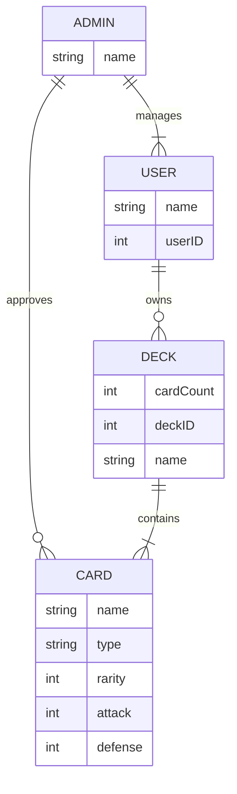
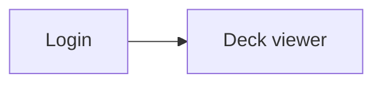
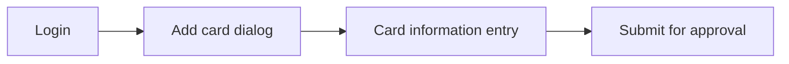
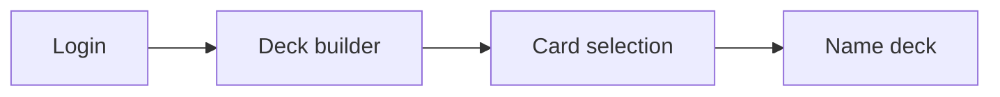
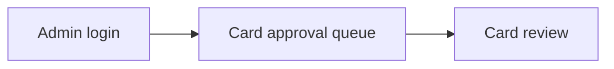
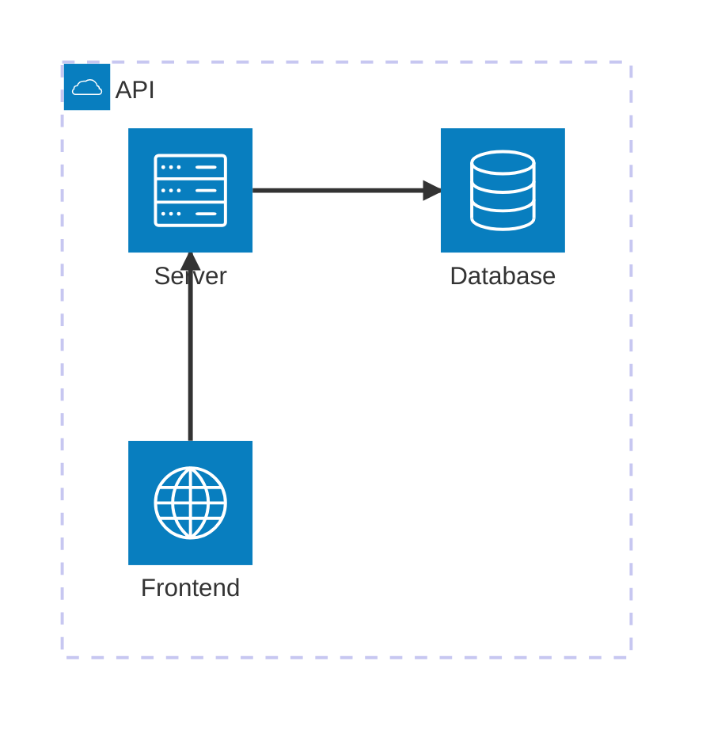
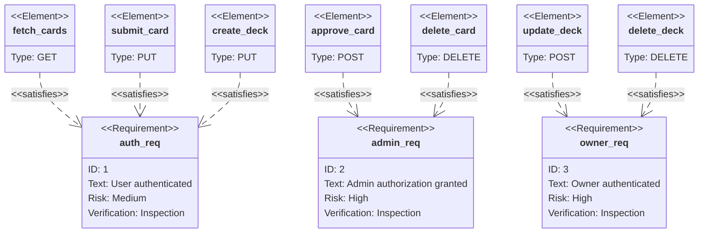
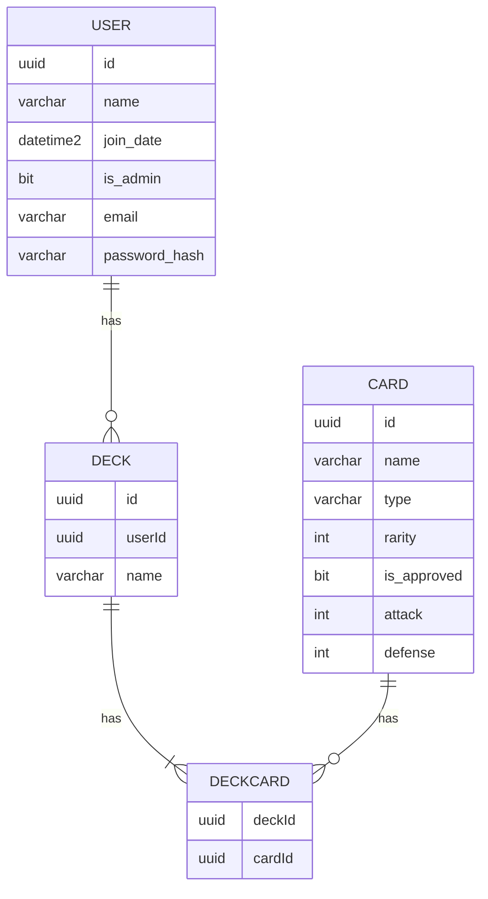

# Diagrams

## Entity Relationship Diagram

## User Flow Diagram

View Cards

Add Card

Create Deck

Approve Card

## Architecture Diagram

## API Endpoints Diagram

## Database Schema

    
